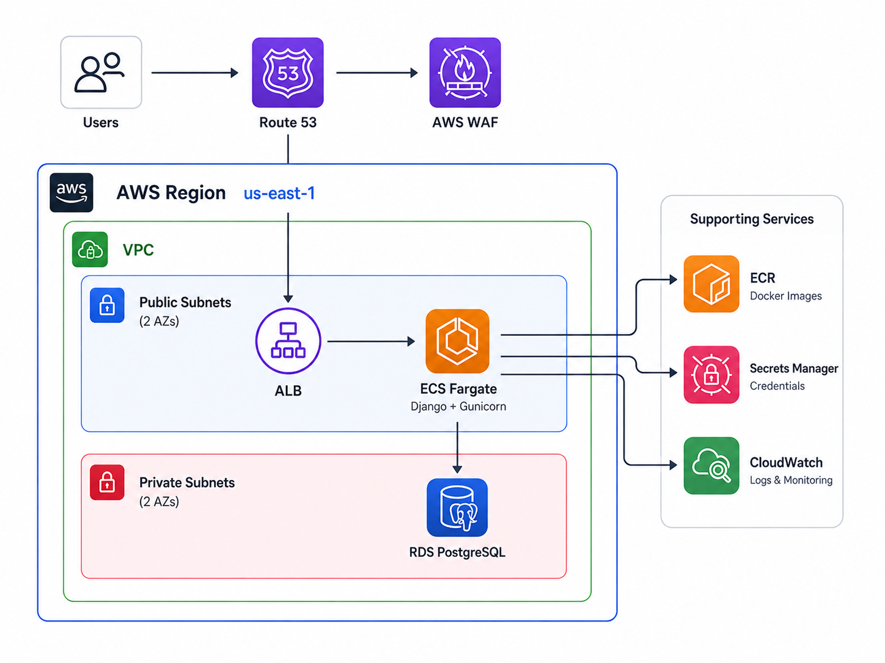
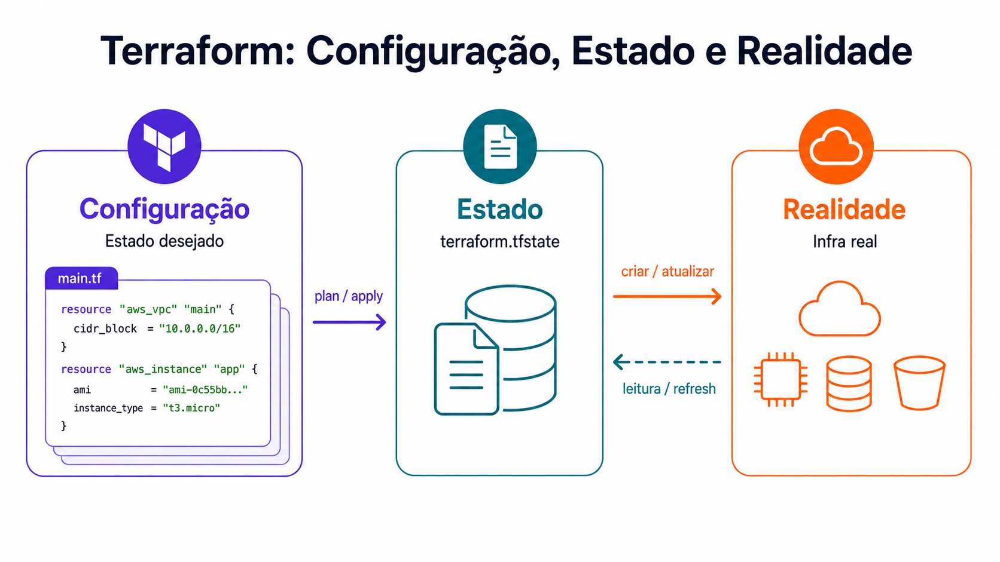
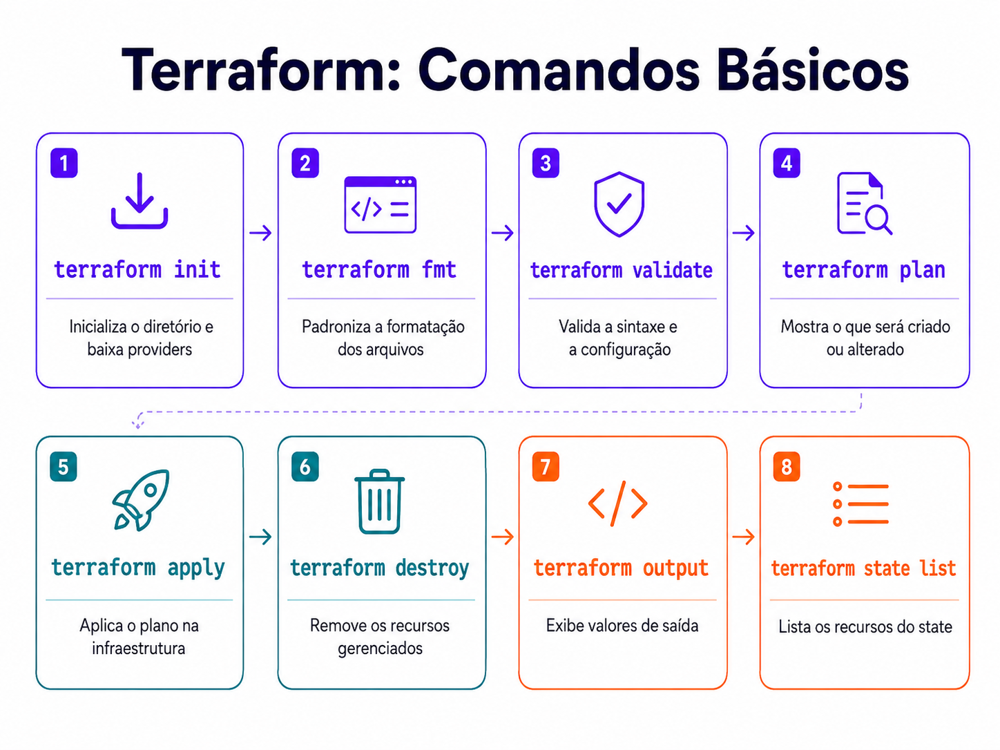

# Aula 0 — Introdução ao Terraform

O mapa antes da mão na massa: o que o Terraform é, como ele pensa, e o primeiro recurso
criado em código — o bucket S3 que vai guardar o state de todas as aulas seguintes.

## O que vamos construir na série



Route 53 na entrada, ALB nas subnets públicas, Django em ECS Fargate, e um RDS PostgreSQL
em subnets privadas — o banco nunca fica exposto. ECR guarda a imagem, Secrets Manager as
credenciais, CloudWatch os logs, e o WAF filtra abuso antes de chegar na aplicação.

Nesta aula nada disso sobe ainda. Só o bucket de state.

## Configuração, estado e realidade



Terraform é uma engine que reconcilia três coisas:

- **Configuração** — os `.tf`, o estado que você deseja
- **Estado** — o `terraform.tfstate`, o que o Terraform sabe que gerencia
- **Realidade** — o que existe de fato na AWS

Todo comando compara os três. `plan` lê a realidade e mostra a diferença; `apply` age
sobre ela. Entender esse triângulo explica praticamente todo comportamento estranho que
aparece depois.

É por isso também que, a partir daqui, você não mexe mais no console: alterar por fora
cria divergência, e o próximo `plan` vai querer desfazer sua mudança.

## Comandos básicos



`apply` é o primeiro da lista que altera algo de verdade — os quatro antes dele são
seguros de rodar a qualquer momento.

## O código desta aula

[`infra/main.tf`](infra/main.tf) tem o mínimo para um recurso existir:

- `required_version = ">= 1.10"` — a versão do Terraform
- `provider "aws"` com `version = "~> 5.0"` — aceita 5.1, 5.2… e nunca pula para o 6
- um `aws_s3_bucket` com nome e tags

```bash
cd infra
terraform init      # baixa o provider
terraform plan      # mostra o que será criado
terraform apply     # cria
terraform destroy   # remove, quando quiser zerar o custo
```

O nome do bucket precisa ser único na AWS inteira, então troque por um seu. O
`profile = "watadados"` só existe porque eu tenho duas contas AWS na mesma máquina —
remova essa linha se você usa o profile padrão.

Se o `destroy` reclamar que o bucket não está vazio, `force_destroy = true` libera a
remoção junto com os objetos. Os objetos não voltam.

## O state não vai para o git

O `terraform.tfstate` guarda valores em texto puro — senha de banco, chaves, qualquer
coisa que um recurso devolva. O [`.gitignore`](../.gitignore) da raiz já cuida disso.

Aqui o state fica local de propósito: este bucket é o bootstrap, ele existe justamente
para guardar o state das próximas aulas. Da Aula 1 em diante o state vai para o S3.
